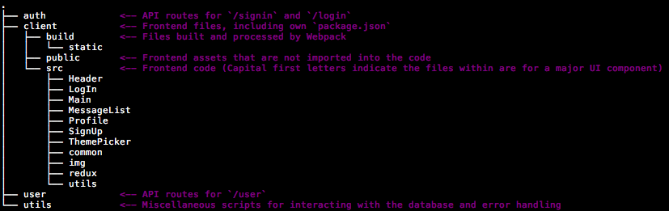

# Full-Stack Template

Base for a full stack web application with a few more time consuming features all ready implemented.

## Setup and Building (Requires a linux-link command line interface)

### Initial Setup

1. After cloning the repo, run `npm install` in the root directory and in the `/client` directory.
2. Ensure a Postgres server is running, then create a new database with `createdb full-stack-template`
3. Import the database structure with `psql full-stack-template < utils/database_schema.sql`

### Building for Development vs Production

In development, the frontend code is served via Webpack's dev server, this allows for hot reloading.

- To build for development type `npm run dev` in the root directory. This will start a watch for both server side and client side files. Any changes to these files will trigger a new build and will automatically reload or open a new browser window.
- To build for production type `npm run prod` in the root directory. This will start one server for both the API and frontend files.

## App Features

- Basic Username/password Authentication via JWT tokens
- Authenticated users can customize the apps color theme

## Development Features

- Hot reloading for both server and client files.
- Support for the [Redux DevTools Browser Extension](https://github.com/zalmoxisus/redux-devtools-extension) with a fallback of [Logger for Redux](https://github.com/evgenyrodionov/redux-logger)

## Major Packages Used

### Server

- [Node.js](https://nodejs.org/en/)
- [Express](https://expressjs.com/)
- [Passport.js](http://www.passportjs.org/)
- [node-postgres](https://github.com/brianc/node-postgres)

### Client

- [React](https://reactjs.org/)
- [Redux](https://redux.js.org/)
- [React Router](https://github.com/ReactTraining/react-router)
- [Material-UI](https://material-ui.com/)
- [Redux Form](https://redux-form.com/7.4.2/)

## Note on File Organization

Files where organized based on _Feature_, instead of by _Type_. For example, all the files necessary for the Sign Up form are in the `SignUp` directory including redux actions and reducers.

Here are the major directories in the project with an explanation of what they contain.

